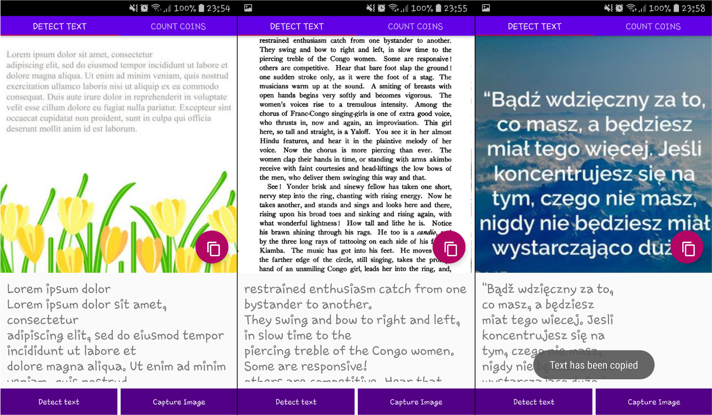
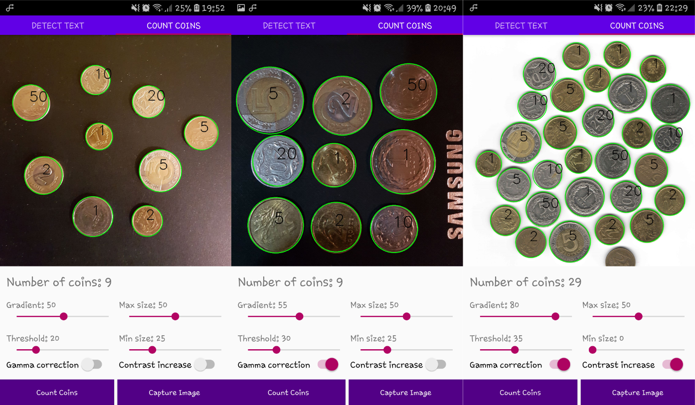

# Projekt indywidualny - Aplikacja mobilna z wykorzystaniem OpenCV
* Aplikacja umożliwia rozpoznanie tekstu na zdjęciu lub grafice przy użyciu ML Kit.
* Aplikacja umożliwia rozpoznanie monety na podstawie jej rozmiaru względem monety o nominale 5 zł.

## Rozpoznawanie tekstu

## Rozpoznawanie monet

